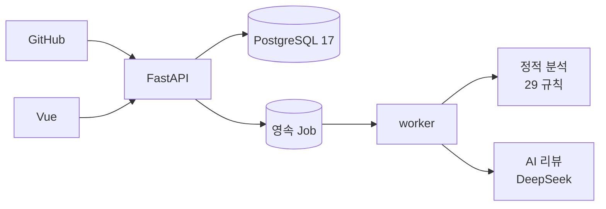

# PRism · 프리즘 — 아키텍처 저장소

> GitHub Pull Request를 고정 커밋 기준으로 정적 분석하고, 사용자가 동의한 경우에만 **근거를 검증하는 AI 리뷰**를 더하는 플랫폼의 **설계·결정 기록 저장소**입니다. 코드는 아래 두 저장소에 있고, 이 저장소는 "왜 이렇게 만들었는가"를 소유합니다.

| 저장소 | 내용 |
|---|---|
| [Prism-Backend](https://github.com/oso7865-ship-it/Prism-Backend) | FastAPI · PostgreSQL · 분석 엔진 · AI 리뷰 · Job worker |
| [Prism-Frontend](https://github.com/oso7865-ship-it/Prism-Frontend) | Vue 3 · TypeScript 웹 클라이언트 |
| **Prism-Architecture** (이 저장소) | 도메인 계약 · ADR 41건 · DB 스키마 · 배포·보안 설계 · 검증 도구 · 작업 기록 |

## 이 저장소를 만든 이유

설계가 코드보다 오래 남으려면 **읽을 수 있고, 검증되고, 바뀐 이유가 남아야** 합니다. 그래서 문서를 코드처럼 다룹니다.

- 결정은 **ADR**로 남기고, 바뀌면 지우지 않고 `대체 관계`로 잇습니다(영역별 41건).
- 문서의 링크·ID·읽기 경로·ADR 관계는 **스크립트가 검증**합니다(`validate_docs.py`).
- AI 에이전트가 문서 전체를 읽지 않도록 **작업이나 경로로 필요한 문서만 골라 주는 선택기**(`context_select.py`)를 둡니다.
- 설계와 구현을 혼동하지 않습니다. **"문서가 있다"는 "구현됐다"가 아니며**, 검증하지 못한 것은 보고서에 미확인으로 적습니다.

## 제품과 설계 원칙

| 구분 | 내용 |
|---|---|
| 지원 언어 | Java · JavaScript · TypeScript · Python |
| 정적 분석 | 고정 commit SHA·규칙·설정 버전에 귀속. 모르는 것은 `NOT_EVALUATED`, 범위 누락은 `PARTIAL`로 표시 |
| AI 리뷰 | 정적 판정을 바꾸지 않는 **설명자**. 서버가 스키마·줄·근거를 검증하고 두 번째 호출로 초안을 재검토. 실패를 "문제 없음"으로 바꾸지 않음 |
| 데이터 | PostgreSQL 17, **물리 FK 없이 논리 참조** + Workspace 단위 직렬화 |
| 실행 | 접수 커밋 후 `202`, 영속 Job + lease 세대로 늦은 worker의 저장 차단 |
| 보안 | 분석 대상 코드를 실행·설치하지 않음. 원문·diff·prompt 비저장. 외부 전송은 요청마다 소유자 동의 |
| 배포 | GitHub Actions → GHCR → AWS EC2 + Caddy(HTTPS), 비루트·읽기 전용 컨테이너 |



## 대표 설계 결정

면접에서 자주 물을 만한 결정을 골랐습니다. 배경·대안·한계는 각 ADR에 있습니다.

| 결정 | 핵심 이유 | 기록 |
|---|---|---|
| 업무 `domain` 소유 + 기술 `shared` 분리, 도메인은 공개 `api.py`로만 호출 | 같은 코드를 여러 곳이 써도 정책의 주인은 하나 | [ARCH-001](docs/architecture/adr/architecture/ADR-ARCH-001-python-domain-boundaries.md) |
| 물리 FK 0개, 앱 레벨 무결성 | 테넌트 경계를 서비스 규칙으로 일관되게 검증하고 Workspace 잠금으로 직렬화 | [DATA-003](docs/architecture/adr/data/ADR-DATA-003-logical-relations-schema.md) |
| 영속 Job + lease fencing | 재시도·중복 실행을 전제로 저장을 멱등하게 | [RUNTIME-001](docs/architecture/adr/runtime/ADR-RUNTIME-001-durable-jobs.md) |
| 정적 스냅샷 분석(코드 실행 안 함) | 신뢰할 수 없는 입력을 실행하지 않는다 | [ANALYSIS-001](docs/architecture/adr/analysis/ADR-ANALYSIS-001-static-snapshot-analysis.md) |
| 수동·동의 기반 AI 리뷰, 근거 우선 검증 | 비용·유출·환각을 구조로 제한 | [REVIEW-003](docs/architecture/adr/review/ADR-REVIEW-003-bounded-manual-code-review.md) · [REVIEW-010](docs/architecture/adr/review/ADR-REVIEW-010-evidence-first-verified-review.md) |
| 저장소 연결을 GitHub 허용 목록에서 선택 | 입력 오류 제거, 체크한 것만 연결·동기화 | [INTEGRATION-003](docs/architecture/adr/integration/ADR-INTEGRATION-003-choose-repositories-from-github.md) |
| 시니어/주니어 설명 모드 | 출력 스키마·검증은 같고 설명 방식만 다르게 | [REVIEW-015](docs/architecture/adr/review/ADR-REVIEW-015-review-modes.md) |

전체 목록은 [결정 맵](docs/architecture/decisions/DECISIONS.md), 아직 정하지 않은 항목은 [미정 사항](docs/architecture/decisions/OPEN_ITEMS.md)에 있습니다.

## 어떻게 읽으면 되나

처음이라면 아래 순서가 가장 빠릅니다.

1. [CORE](docs/architecture/CORE.md) — 바뀌면 안 되는 경계
2. [문서 지도](docs/architecture/INDEX.md) — 작업별 입구
3. [Review 계약](docs/architecture/domain/review/README.md) · [DB 스키마](docs/architecture/contracts/schema/README.md) · [배포 설계](docs/architecture/operations/DEPLOYMENT.md)

```text
docs/architecture/
  CORE.md · INDEX.md      공통 기준 · 문서 지도
  domain/                 업무별 소유 계약 (auth · workspace · repository · analysis · review · standards …)
  shared/                 공통 기술 계약 (database · jobs · security · github · observability)
  contracts/              HTTP API · 데이터 모델 · 테이블 20개 물리 스키마
  runtime/ operations/    조립·Worker · 배포·보안·개인정보
  adr/                    영역별 결정 기록과 작성 규칙
  context-map.json        문서·작업·ADR 매핑(검증 대상)
scripts/                  문서 검증 · 읽기 경로 선택 · 기록 보존 검증
legacy/                   압축·개편 전 원문 보존
records/                  개발 기록·평가 결과 보존(해시 검증)
```

## 검증

문서와 도구만 확인하므로 Git과 Python 3.10+ 외에 설치할 것이 없습니다(표준 라이브러리만 사용).

```bash
git clone https://github.com/oso7865-ship-it/Prism-Architecture.git && cd Prism-Architecture
python scripts/validate_docs.py       # 링크·문서 ID·읽기 경로·ADR 관계 무결성
python scripts/check_helpers.py       # 선택기·ADR 오류 검출 도구 자체 테스트
python scripts/validate_records.py    # 보존 기록의 바이트 해시
python scripts/context_select.py --task database
```

이 검증은 **문서 무결성**만 다룹니다. 애플리케이션 동작·성능·보안·실제 GitHub/AWS/DeepSeek 연동은 구현 저장소의 테스트·CI와 [작업 기록](records/README.md)이 근거입니다.

## 현재 상태 (2026-10-06)

- 구현·배포: 로그인·팀·저장소 연결(허용 목록 선택)·PR 동기화·정적 분석·AI 리뷰(목적 3종·설명 모드 2종)·팀 문서 기준 리뷰가 구현되어 EC2에 배포되어 있습니다. 실제 GitHub App 연결과 운영 migration 적용도 확인했습니다.
- 데이터: migration 0011, 업무 테이블 20개, 물리 FK 0개.
- 품질: AI 리뷰는 합성 평가셋의 위치·형식·정상 오탐 게이트를 통과했지만 **독립 사람 검수와 범용 의미·수정안 품질은 미완료**입니다. 최신 수치와 한계는 [최종 검증 보고서](records/2026-09-29_final-validation-report.md)가 기준입니다.
- 다음 작업: 허용 저장소 300개 초과 시 연결 후보 처리, 설계 문서의 오래된 구현 현황(예: [IMPLEMENTATION](docs/architecture/runtime/IMPLEMENTATION.md)) 정리.

## 보존 자료

- [legacy](legacy/README.md): 문서 압축·README 개편 전 **원문 그대로의 사본**
- [records](records/README.md): 2026-09-28~30 개발 기록·하네스·평가 결과. 파일 해시를 `manifest.json`으로 검증하며 구현 저장소의 복원 도구가 이 경로를 읽으므로 위치를 옮기지 않습니다.

## AI와 이어서 작업하기

[AGENTS.md](AGENTS.md)가 진입 규칙입니다. 문서 전체를 읽지 않고 `context_select.py --task` 또는 `--path`로 필요한 문서만 고릅니다. 작업을 마치면 `validate_docs.py`를 실행하고, 아직 정해지지 않은 외부 서비스 설정은 임의로 확정하지 않습니다.
