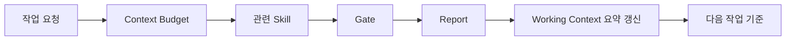

# 05. WORKING CONTEXT

> 한국어 별칭: 현재 작업 상태 요약  
> 목적: 장기 작업에서 현재 상태, 결정사항, 대기 항목, 다음 작업을 잃어버리지 않게 관리한다.

> **이 문서는 신규 프로젝트 부착용 빈 템플릿이다.** `GENERAL_HARNESS`를 만들고 다듬는 과정에서 쌓인 상태 이력·결정사항·작업 큐는 전부 `_WORKING_CONTEXT_HISTORY.md`("GENERAL_HARNESS 자체 개발 이력 완결편" 섹션)로 이관했다. 이 하네스를 실제 프로젝트에 부착하면, 아래 §1~§3의 빈 표를 그 프로젝트의 실제 상태로 채운다. §4~§10은 프로젝트와 무관하게 적용되는 운영 규칙이라 그대로 둔다.

---

## 1. 현재 프로젝트 상태

> 이 표는 하네스를 부착한 대상 프로젝트의 지금 시점 실제 값을 채운다. 프로젝트가 아직 없으면 빈 채로 둔다.

| 항목 | 상태 |
|---|---|
| 프로젝트명 | prism-backend |
| 기술 스택 | Python 3.12 / FastAPI / PostgreSQL |
| 하네스 부착일 | 2026-09-25 |
| 활성 스킬 | 21개(기본 구성 20개 + 스택 한정 1개 `vue-ui-polish`, 프로젝트 전용 스킬 추가 시 갱신) |
| 활성 Gate | 7개(기본 구성) |
| 활성 Checklist | 6개(기본 구성) |
| 자동화 | 최소 검증 스크립트 7개(기본 구성) |
| 최신 Report 포인터 | `reports/_LATEST.md`가 가리키는 Report를 따르되, **이 프로젝트에 아직 project Report가 없으면 `_LATEST.md`는 여전히 하네스 자체의 마지막 유지보수 Report를 가리키고 있을 수 있다.** 그 경우 "프로젝트의 최신 상태"가 아니라 "하네스 자체의 최신 상태"이니 혼동하지 않는다. 이 프로젝트의 첫 작업을 마치고 첫 Report를 게시하는 순간부터 `_LATEST.md`는 project Report로 전환된다(부착 절차는 `09.AGENT_WORKFLOW.md §7-2` 참고) |

---

## 1-1. 프로젝트 상수

> 여러 Report에서 반복 등장하는 장기 제약(예: "자동화 테스트 미구축", "스테이징 환경 없음")을 여기 한 번만 기록한다. 여기 기록된 항목은 Report마다 반복 기재하지 않는다(`06.REPORT_TEMPLATE.md §5-2`). 아직 없으면 빈 채로 둔다.

| 상수 | 기록일 | 해소 조건 |
|---|---|---|
| 서비스 배포 환경 미구축 | 2026-09-25 | 배포 주소·호스팅 결정 및 검증 |

---

## 현재 기능 상태 — 2026-09-28

2026-09-28 계약 복원·진단·동일 조건 비교를 완료했다. Linux359 tests PASS. 최종 후보는 핵심 결함 위치6/6이지만 설명·개선안 정확도3/6으로 채택 FAIL, 신규 사례24/24·기존 회귀45/46이다. 실패 후보는 evals/recall-repair에 보존하고 제품 지침은 rh1-d634ca5b77229914로 복원했다. V4 16/48KiB·리뷰당2회·팀 하루30·리랭커 OFF 유지. 유료 누적1352/3000·잔여1648, 자동 실행 없음. 기존 v1 잠정11/18은 축약 계약 오류가 있어 실제 PR recall로 사용하지 않는다. 독립 사람 검수와 값·분기·예외 추론 오류 해결이 남았다. API/Vite200, DB0008. frontend 변경 없음. backend/frontend dev·architecture main, 미커밋·미푸시. 보고서는 reports/_LATEST.md.

## 2. 핵심 결정사항

> 이 프로젝트에서 내린 구조적 결정을 아래 형식으로 기록한다. 아직 없으면 빈 채로 둔다.

| 번호 | 결정 | 이유 |
|---:|---|---|
| ADR-ARCH-002 | 백엔드·프론트 독립 저장소와 하네스 사본 | 다른 PC에서 독립 재개 |

---

## 3. 현재 작업 큐

> 이 프로젝트의 열린 작업을 우선순위와 함께 기록한다. 아직 없으면 빈 채로 둔다.

| 우선순위 | 작업 | 상태 |
|---|---|---|
| 1 | 값·기본값·예외 시점 오류 해결·독립 라벨 검수 | 핵심 의미3/6·경계 누락1; 후보 미채택 |
| 2 | 새2단계 리뷰 실제 조직 PR 제품 흐름 | 새 실호출 미검증; 전송 범위 승인 확인 후 진행 |
| 3 | Git 게시·배포 | 이번 요청 범위 아님 |
| 4 | 하네스 원본 동기화 | 사용자 요청으로 보류 |

---

## 4. Report 읽기 우선순위

Report가 여러 개 있으면 `reports/_LATEST.md`를 먼저 확인한다.
오래된 Report는 결정 근거와 변경 증거로만 사용하고, 다음 작업 판단은 `_LATEST.md`가 가리키는 최신 Report와 Working Context를 우선한다. **단, `reports/archive/HISTORY_DIGEST.md`의 PURGE_EVENT에 포함된 파일은 원본이 삭제된 상태다 — 그 경우 상세 근거는 digest 요약 한 줄로 대체되며 원본을 직접 열어 재현할 수 없다(외부 검수 M-07/X-07).**

| 상황 | 처리 |
|---|---|
| 최신 Report와 오래된 Report의 다음 작업이 다름 | 최신 Report와 Working Context를 우선 |
| 오래된 Report가 superseded로 표시됨 | 증거로만 보관하고 다음 작업 기준에서 제외 |
| 최신 Report에도 미해결 WARN/FAIL 존재 | 새 작업 전 재판정 |

---

## 5. Report와 Working Context 책임 분리

| 문서 | 역할 | 기록 수준 |
|---|---|---|
| `06.REPORT_TEMPLATE.md` | 작업 단위 증거 기록 | 변경 파일, 검증 명령, PASS/WARN/FAIL 근거, 미해결 항목을 상세 기록 |
| `05.WORKING_CONTEXT.md` | 현재 상태 요약 | 최신 결정, 열린 작업 큐, 반복되는 WARN/FAIL, 다음 작업만 요약 |

원칙:

- Report는 **작업별 상세 증거**다.
- Working Context는 **현재 상태와 다음 판단 기준**이다.
- Report 내용을 Working Context에 전부 복사하지 않는다.
- 반복되거나 다음 작업에 영향을 주는 핵심만 Working Context에 요약한다.

---

## 6. 실패/중단 후 재개 규칙

재개 절차의 공식 소유 기준은 `09.AGENT_WORKFLOW.md §7`이다. 이 문서는 현재 상태 요약 관점에서 아래 원칙만 유지한다.

- 작업 실패 또는 중단 후에는 새 작업을 바로 시작하지 않는다.
- 마지막 Report, Working Context, 실제 변경 파일, 남은 FAIL/WARN을 먼저 확인한다.
- 위험 작업에서 중단된 경우, 사용자 확인 또는 추가 근거 확보 전까지 이어서 수정하지 않는다.
- 완료 여부가 불명확한 변경은 완료로 표시하지 않는다.

---

## 7. 장기 요약 규칙

Report가 많아지면 Working Context에 아래 형식으로 요약한다.

```md
## YYYY-MM-DD 상태 요약

- 최근 완료:
- 남은 WARN/FAIL:
- 다음 작업에 영향을 주는 결정:
- 더 이상 읽지 않아도 되는 오래된 맥락:
- 다시 확인해야 하는 증거 Report:
```

오래된 세부 내용은 Report에 남기고, Working Context에는 다음 판단에 필요한 요약만 남긴다.

이 문서의 "상태 요약" 섹션은 **최신 1개 라운드만** 남긴다. 새 라운드가 끝나면, 그 이전까지 남아있던 상태 요약 섹션을 `_WORKING_CONTEXT_HISTORY.md`로 옮기고 이 문서에는 새 라운드 요약만 추가한다. 옮길 때 내용을 요약하지 않고 그대로 이관해 정보 손실이 없게 한다.

---

## 8. 변경 시 갱신 규칙

다음 일이 발생하면 이 문서를 갱신한다.

- 활성 스킬이 추가/삭제됨
- Gate 기준이 바뀜
- 체크리스트가 늘어남
- 자동화 스크립트가 추가됨
- 주요 결정이 바뀜
- 보류 항목이 실제 도입됨
- Critical/Major WARN/FAIL이 반복됨
- 실패/중단 후 재개 기준이 생김

---

## 9. 상태 기록 형식

```md
## YYYY-MM-DD 작업 기록

- 작업 요약:
- 변경 파일:
- 적용 Gate:
- PASS/WARN/FAIL:
- 미해결 항목:
- 다음 작업:
```

---

## 10. Working Context 연결 구조



요약: Report가 상세 증거를 남기고, Working Context는 그중 다음 판단에 필요한 상태만 요약한다.

---

`GENERAL_HARNESS` 자체를 만들고 다듬은 이력 전체는 `_WORKING_CONTEXT_HISTORY.md`("GENERAL_HARNESS 자체 개발 이력 완결편" 섹션)로 이관했다. 새 프로젝트에 이 하네스를 부착하면, 이 문서(§1~§3)는 그 프로젝트의 상태로 새로 채우고, 하네스 자체의 개발 결정이 왜 그렇게 됐는지 궁금하면 이력 파일과 `10.ADR.md`를 참고한다.

## 2026-09-26 사용자 브랜치 운영 결정

- 백엔드·프론트엔드 구현 작업은 dev에서 진행한다. 최신 main 커밋에서 dev 생성, origin/dev push 및 upstream 연결 완료.
- 아키텍처 저장소(Prism-Architecture)는 main에서 계속 작업한다.
- main 반영은 별도 사용자 요청에 따른다. 하네스 동기화는 계속 보류하며 기존 미커밋 변경은 보존했다.


## 2026-09-26 정적 분석 현재 상태

- PR 분석 접수·취소·이력·결과·재분석 및 Tree-sitter 4언어23규칙 구현. 0005 적용, 업무15테이블/FK0.
- 실제 조직 PR #47에서 1파일/COM-002 1건 완료 및 재분석 확인. 전체134 tests + 이후 추가 parser 취소 테스트 포함 규칙42 tests, 프론트 build/23 tests PASS.
- Windows 네이티브 진단 재발은 원인 미해결. 상세는 reports/2026-09-26_static-analysis_report.md.
- dev working-tree 미커밋·미푸시. 다음: DeepSeek Review, 고급 규칙/설정, 공개 Webhook 실전송·배포. 하네스 원본 동기화 계속 보류.

## 2026-09-26 AI 품질·안정성 검증 후속

- 최신 reports/_LATEST.md: quality-stability Report. 유료7회, 모델 deepseek-flash, 평가 버전 rh1-3255b8329435eda1. 자동6/7 PASS, 락 문맥 부족 오탐1사례 FAIL. 입력8997/출력2153토큰.
- 지침 보완 버전 rh1-3b9b53482a3791ef 적용. 수정 후 실제 모델 재평가 미수행. 실패 기준을 완화하지 않음.
- backend 최종170 tests PASS/49.76초, Ruff/mypy PASS. 교차 팀 조회/취소, 실행 중 취소·강등·lease 만료, 동시4접수 검증 추가.
- Windows native 진단은 초기/관련 suite 재현, 최종 실행에서는 미발생. GSS 해제도 재현, 근본 원인 미확인 WARN. 영구 설정/TLS/의존성 변경 없음.
- 후속: 수정 지침 재평가/반복 측정, native 디버거 원인 조사. dev 미커밋, 원본 하네스 동기화/게시 없음.

## 2026-09-26 게시 준비 최신 상태

사용자가 변경 정리·커밋·푸시·CI 확인을 승인했다. 아키텍처 main cac51a07516cd2e36b3bf4cc45c9a17fad050002 게시 완료, 소비 revision 연결 완료. 구현 저장소는 dev 게시 준비 중이며 최신 상태는 reports/_LATEST.md를 따른다. 과거 미커밋/다음 작업 기록은 당시 이력이다. 하네스 동기화와 main 병합·배포는 미수행.

## 2026-09-26 게시 완료 관측

origin/dev 259c3caa62c482d26c1ab005b62f4338083c3171 push 완료, GitHub Actions 36245552982 success 확인. 이전 게시 준비/미커밋 표기는 당시 이력이다. 이 후속 문서 기록도 별도 커밋으로 공유한다. main 병합/배포 및 원본 하네스 동기화는 미수행. 최신 Report가 현재 Next Work 기준이며, AI 문맥 부족 오탐과 GameGuard 없는 Windows 세션 검증이 남아 있다.

## 2026-09-27 근거 검증·규칙 확장

최신 reports/_LATEST.md는 evidence-rules Report. backend208 tests/프론트40 tests/build PASS, AI 근거 계약 rh1-f48cca7b771801e0 및 static-1.1.0/29규칙 구현. 실제 코드110파일 점검. 추가 유료7회는 자동 승인 거절 후 사용자 질문 대기·호출0. Windows는 시작 모듈없음→테스트 중 GameGuard 로드·native진단2회, 깨끗한 세션 검증 미완료. 변경은 dev 및 architecture main working-tree에 있으며 미커밋/미푸시. 원본 하네스 동기화 보류.

## 2026-09-27 추가 유료 평가 결과

사용자의 새 명시 승인으로 rh1-f48cca7b771801e0 합성7호출 수행. 구조7/7, 내용6/7로 락 미제공 문맥 오탐1건 유지. 입력12,392/출력2,240토큰. 추가 호출·재시도0, 승인7회 소진. 직전 승인 대기/호출0 메모는 승인 전 이력이다. 상세는 백엔드 reports/2026-09-27_evidence-rules_report.md 추가 평가 절. 코드 변경·커밋·푸시 없음.

## 2026-09-27 배포 전 준비

production/HTTPS·쿠키·DB TLS, Docker/Render/Vercel 템플릿, 운영 절차 준비. backend222 tests/프론트51 tests/build, 테스트DB 복원과100소형파일 컨테이너 PASS. 이번 Windows 모듈없음/오류0. 실제 로컬 로그인·조직PR·기존분석결과 확인. 배포·유료AI호출0. 게시 결과는 reports/2026-09-27_predeployment_report.md 후속 기록을 따른다. 주소·DB/CA·운영키·예산/알림·실제 배포 연동은 후속. 이전 미커밋/Windows 오류 메모는 당시 이력이다.

게시 관측 2026-09-27T01:12:49+09:00: origin/dev 76443f943ff7d4254d51b811e968699d259ee8fb push 성공. 현재 미커밋은 게시 결과 문서 갱신만이며, CI 결과는 최신 Report 후속 절을 따른다.

## 2026-09-27 배포 전 작업 최종 관측

2026-09-27T01:22:02+09:00: architecture main c9275e6 CI36254469671, backend dev85038e2 CI36255001493, frontend dev98a4fce CI36254575184 success. backendLinux225 tests·migration왕복·Docker100소형파일, 프론트51 tests/build, 로컬DB합성복원 PASS. 작업 계획과 최신 Report 동기화. 현재 후속 변경은 게시 결과 문서만이다. Windows 마지막 전체 회귀224 passed/native진단2·GameGuard로드로 환경 이슈 유지. 남은 결정은 주소·DB/CA·운영키·예산/알림·실제 공개연동이며 배포/유료호출/main병합/원본하네스동기화는 하지 않았다.

## 2026-09-27 품질 안정화 상태 요약

- 최신 reports/2026-09-27_ai-quality-stabilization_report.md. backend dev / architecture main 미커밋·미푸시, 기존 변경 보존. 프론트 변경 없음.
- 수정: 파일별 evidence_lines 예시·가상의 null/반환 계약 억제·언어/내장 계약 구분, ESM 명시 확장자 관련 파일 선택. strict 검증/원문 비저장/권한/입력 예산 유지.
- ADR-REVIEW-009: 새 결과 summary는 검증된 제안/질문 건수와 우선 제목3개로 서버 조합. 모델 summary도 기존 strict/비밀 검증, 별도 원문 저장 없음. 기존 이력 불변. 현재 prompt rh1-6ec65eef38a071f7 / BOUNDED_CODE_V3.
- 품질: 초기 근거 혼용7/12 거절→같은 사례12/12. 최종 경계72/72·기존65/66 자동, 구조138/138. 수동 검수에서 정상 가드 오탐1건과 잘못된 추가 설명2응답이 남아 의미 품질 게이트 FAIL. 공개 출시/일반 정확도 주장 금지.
- 추론 옵션 합성24+대조24: 둘 다22/24, 추론 출력토큰2.08배·정상 질문2건·요약 모순 때문에 미채택. scripts 전용이며 제품은 비추론·출력2000·60초·1호출/재시도0·일일30·리랭커 OFF 유지.
- 실제 조직 PR49 제품 리뷰는 사용자 별도 승인1회 COMPLETED (f0f97402-a45b-44df-9504-5a0b955e07e1), 당시prompt7562·6파일/7제외·지적0질문0. 최신 최종 버전으로 실제 PR 재평가는 하지 않음.
- 승인 사용757/3,000(합성756+제품1; 초기 연결실패12 포함), 잔여2,243. 입력3,281,381/출력161,167토큰 관측. usage.json 호출전 예약 유지, 실제 PR1회 승인 소진. 기존50회 대체/이전24회 별도. 추가 자동 실행 없음.
- 검증: 최종 Linux308 tests/62.54초, Ruff/format157파일·mypy117파일 PASS. architecture77문서/315링크/25ADR PASS(길이WARN2). Windows DB 테스트는 native/BSOD 사유로 수행 안 함. 기존 scripts2파일 lint5건/format은 이번 범위 밖으로 보존.
- 로컬 적용: 진행job/review0 확인 뒤 API launcher43352 재시작, ready200/Vite200, AI ON·일일30·reranker OFF. 개발 DB/결과 보존, 임시 Linux DB/네트워크 제거.
- 다음: 실제 PR 사람 정답표 기반 의미 품질 평가, 정상 예외 전파 오탐·불필요 추가 주장 개선. 모델 오류를 자동 채점 통과로 덮지 않는다. 배포·공개 Webhook·다사용자 운영/Windows 원인 검증·원본 하네스 동기화는 미진행.
